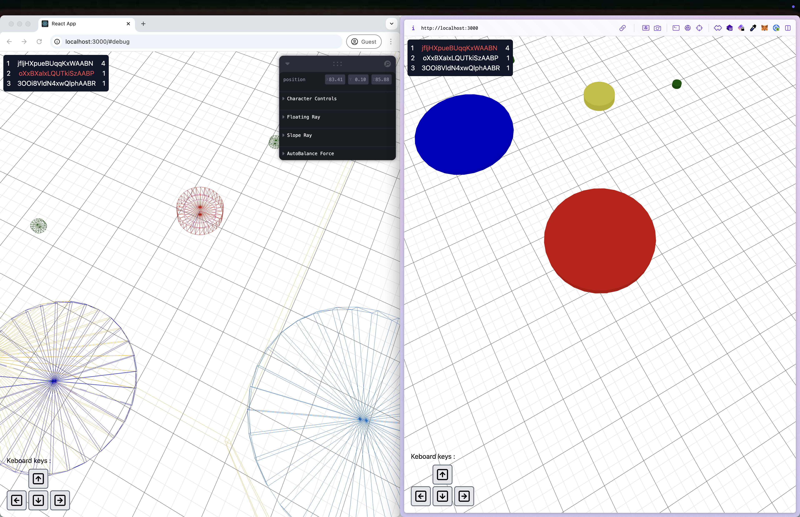

# Agario like



Pour le lancer il faut lancer le serveur et le client, si vous lancer le serveur en premier, je vous recommandes de recharger la page du client.
```
pnpm i
pnpm start
```

le serveur démarre sur le port 3001
le client démarre sur le prot 3000

pour tester http://localhost:3000
pour la version debug http://localhost:3000/#debug (attention en debug c'est beaucoup moins stable et fluide a cause des shaders de debug, il n'est pas conçu pour jouer mais débuger)

Pour les explications techniques 📖 :

https://tested-handspring-20b.notion.site/Agar-io-like-14227fef6616809293b8d3d1b6282bd1
